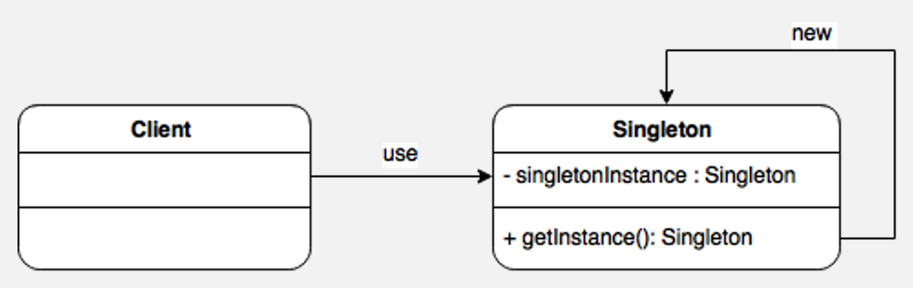
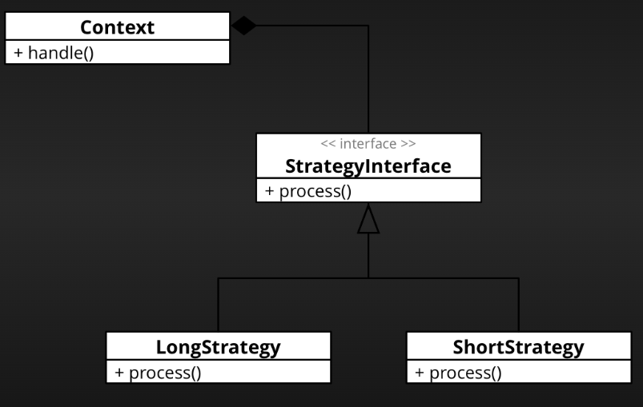
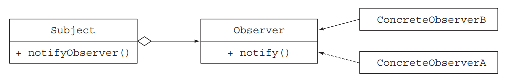

# Design Patterns in Java

> This is a Java course to understand design patterns

Tools used:

- JDK 11
- Maven
- JUnit 5, Mockito
- IntelliJ IDE

## Table of contents

1. [Introduction](https://github.com/backstreetbrogrammer/29_DesignPatterns#chapter-01-introduction)
2. [Creational Patterns](https://github.com/backstreetbrogrammer/29_DesignPatterns#chapter-02-creational-patterns)
    - [Singleton](https://github.com/backstreetbrogrammer/29_DesignPatterns#singleton)
    - [Builder](https://github.com/backstreetbrogrammer/29_DesignPatterns#builder)
    - [Factory](https://github.com/backstreetbrogrammer/29_DesignPatterns#factory)
    - [Abstract Factory](https://github.com/backstreetbrogrammer/29_DesignPatterns#abstract-factory)
3. [Structural Patterns](https://github.com/backstreetbrogrammer/29_DesignPatterns#chapter-03-structural-patterns)
    - [Decorator](https://github.com/backstreetbrogrammer/29_DesignPatterns#decorator)
    - [Adapter](https://github.com/backstreetbrogrammer/29_DesignPatterns#adapter)
    - [Flyweight](https://github.com/backstreetbrogrammer/29_DesignPatterns#flyweight)
    - [Proxy](https://github.com/backstreetbrogrammer/29_DesignPatterns#proxy)
4. [Behavioral Patterns](https://github.com/backstreetbrogrammer/29_DesignPatterns#chapter-04-behavioral-patterns)
    - [Strategy](https://github.com/backstreetbrogrammer/29_DesignPatterns#strategy)
    - [Observer](https://github.com/backstreetbrogrammer/29_DesignPatterns#observer)
    - [Template](https://github.com/backstreetbrogrammer/29_DesignPatterns#template)
    - [Command](https://github.com/backstreetbrogrammer/29_DesignPatterns#command)
    - [Chain of responsibility](https://github.com/backstreetbrogrammer/29_DesignPatterns#chain-of-responsibility)

---

## Chapter 01. Introduction

Design patterns are typical solutions to common problems in software design. Each pattern is like a blueprint that we
can customize to solve a particular design problem in our code.

Design patterns differ by their complexity, level of detail and scale of applicability. In addition, they can be
categorized by their intent and divided into three groups:

- **Creational Patterns** provide object creation mechanisms that increase flexibility and reuse of existing code.
- **Structural Patterns** explain how to assemble objects and classes into larger structures, while keeping these
  structures flexible and efficient.
- **Behavioral Patterns** take care of effective communication and the assignment of responsibilities between objects.

---

## Chapter 02. Creational Patterns

**Creational Patterns** deal with the process of creation of objects of classes.

### Singleton

- Ensures a class has only one instance
- Provides a global access point to that instance
- Java's implementation makes use of a private constructor, a static method combined with a static variable.



```java
public class Singleton {

    // write once when the class is initialized - always thread safe
    private static Singleton instance = new Singleton();

    private Singleton() {
    }

    public static Singleton getInstance() {
        return instance; // no lock required for reads by multiple threads
    }

    // other useful methods

}
```

There is one caveat: a privileged client can invoke the private constructor reflectively with the aid of the
`AccessibleObject.setAccessible()` method. If we need to defend against this attack, we can modify the constructor to
make it throw an exception if it’s asked to create a second instance.

The MOST correct, clean and concise implementation of Singleton design pattern is to use **ENUM**.

```java
public enum Singleton {
    INSTANCE;

    // other useful methods
}
```

The same way it is used all over JDK APIs, for ex:

```java
enum NaturalOrderComparator implements Comparator<Comparable<Object>> {
    INSTANCE;

    @Override
    public int compare(final Comparable<Object> c1, final Comparable<Object> c2) {
        return c1.compareTo(c2);
    }

    @Override
    public Comparator<Comparable<Object>> reversed() {
        return Comparator.reverseOrder();
    }
}
```

### Builder

Used to encapsulate the construction of a product and allow it to be constructed in steps.

Instead of making the desired object directly, the client calls a constructor (or static factory) with all the
**required** parameters and gets a **builder** object.

Then the client calls setter-like methods on the builder object to set each optional parameter of interest.

Finally, the client calls a parameterless build method to generate the object, which is typically **immutable**. The
builder is typically a `static` member class of the class it builds.

```java
// Builder Pattern
public class Pizza {

    private int size; // required
    private boolean cheese;
    private boolean pepperoni;
    private boolean bacon;

    public static class Builder {
        //required
        private final int size;

        //optional
        private boolean cheese = false;
        private boolean pepperoni = false;
        private boolean bacon = false;

        public Builder(final int size) {
            this.size = size;
        }

        public Builder cheese(final boolean value) {
            cheese = value;
            return this;
        }

        public Builder pepperoni(final boolean value) {
            pepperoni = value;
            return this;
        }

        public Builder bacon(final boolean value) {
            bacon = value;
            return this;
        }

        public Pizza build() {
            return new Pizza(this);
        }
    }

    private Pizza(final Builder builder) {
        size = builder.size;
        cheese = builder.cheese;
        pepperoni = builder.pepperoni;
        bacon = builder.bacon;
    }

}
```

Code snippet to use builder pattern:

```
Pizza pizza = new Pizza.Builder(12)
                       .cheese(true)
                       .pepperoni(true)
                       .bacon(true)
                       .build();
```

This client code is easy to write and, more importantly, easy to read.

The `Pizza` class is **immutable**, and all parameter default values are in one place. The builder’s setter methods
return the builder itself so that invocations can be chained, resulting in a _fluent_ API.

### Factory

Defines an interface for creating an object, but lets subclasses decide which class to instantiate. Factory Method lets
a class defer instantiation to subclasses.

In other words, the factory design pattern lets us create objects **without exposing the instantiation logic** to the
client.

Suppose that we're working for a bank that needs a way of creating different financial products: loans, bonds, stocks,
and so on. Typically, we’d create a `Factory` class with a static method that's responsible for the creation of
different objects, as shown here:

```java
public class ProductFactory {

    public static Product createProduct(final String name) {
        switch (name) {
            case "loan":
                return new Loan();
            case "stock":
                return new Stock();
            case "bond":
                return new Bond();
            default:
                throw new RuntimeException("No such product " + name);
        }
    }
}
```

Here, `Loan`, `Stock`, and `Bond` are subtypes of `Product`. The `createProduct()` method could have additional logic to
configure each created product. But the benefit is that we can create these objects without exposing the constructor and
the configuration to the client, which makes the creation of products simpler for the client, as follows:

```
Product p = ProductFactory.createProduct("loan");
```

### Abstract Factory

Abstract factory creates a base class with abstract methods defining methods for the objects that should be created.
Each factory class which derives the base class can create their own implementation of each object type.

The main difference between a **Factory method** and an **Abstract Factory** is that the **Factory method** is a
`method`, and an **Abstract Factory** is an `object`.

Because the **Factory method** is just a method, it can be overridden in a subclass,

> ... the Factory Method pattern uses inheritance and relies on a subclass to handle the desired object instantiation.

The quote assumes that an object is calling its own factory method here. Therefore, the only thing that could change
the return value would be a subclass.

The **Abstract Factory** is an object that has multiple factory methods on it.

> ... with the Abstract Factory pattern, a class delegates the responsibility of object instantiation to another object
> via composition ...

What they're saying is that there is an object `A`, who wants to make a `Foo` object. Instead of making the `Foo` object
itself (e.g., with a **factory method**), it's going to get a different object (the **abstract factory**) to create the
`Foo` object.

**_Code Examples_**

To show the difference, here is a **Factory method** in use:

```java
class A {
    public void doSomething() {
        final Foo foo = makeFoo();
        foo.doSomethingElse();
    }

    protected Foo makeFoo() {
        return new RegularFoo();
    }
}

class B extends A {
    protected Foo makeFoo() {
        //subclass is overriding the factory method 
        //to return something different
        return new SpecialFoo();
    }
}
```

And here is an **Abstract Factory** in use:

```java
class A {
    private Factory factory;

    public A(Factory factory) {
        this.factory = factory;
    }

    public void doSomething() {
        //The concrete class of "foo" depends on the concrete class
        //of the factory passed into the constructor. If we provide a
        //different factory, we get a different Foo object.
        final Foo foo = factory.makeFoo();
        foo.doSomethingElse();
    }
}

interface Factory {
    Foo makeFoo();

    Bar makeBar();

    Aycufcn makeAmbiguousYetCommonlyUsedFakeClassName();
}

//need to make concrete factories that implement the "Factory" interface here
```

To sum up, the **Factory Method** uses `inheritance` as a design tool. Meanwhile, **Abstract Factory** uses
`delegation`.

The **Factory Method** relies on a derived class to implement, whereas the base provides expected behavior.
Additionally, it is over-method and not over a class.

On the other hand, **Abstract Factory** is applied over a class.

Both follow `OCP` and `SRP`, producing a loosely coupled code and more flexibility for future changes in our codebase.
The creation code is in one place.

**When to Use Abstract Factory Pattern**

- The client is independent of how we create and compose the objects in the system
- The system consists of multiple families of objects, and these families are designed to be used together
- We need a run-time value to construct a particular dependency

While the pattern is great when creating predefined objects, adding the new ones might be challenging. To support the
new type of objects will require changing the `AbstractFactory` class and all of its subclasses.

---

## Chapter 03. Structural Patterns

The Structural Patterns explain how to assemble objects and classes into larger structures, while keeping these
structures flexible and efficient, e.g. Adapter and Decorator.

### Decorator

A Decorator pattern can be used to attach additional responsibilities to an object either statically or dynamically.
Decorators provide a flexible alternative to sub-classing for extending functionality.

In the implementation of this pattern, we prefer **composition** over an **inheritance** – so that we can reduce the
overhead of subclassing again and again for each decorating element.

Suppose we have a `Pizza` object, and we want to decorate it. The decoration does not change the object itself; it's
just that in addition to the `Pizza`, we're adding some decoration items like cheese, pepperoni, bacon, etc.

```java
public interface Pizza {
    String decorate();
}
```

The implementation of this interface will look like:

```java
public class PizzaImpl implements Pizza {
    @Override
    public String decorate() {
        return "Yummy Pizza";
    }
}
```

We'll now create an **abstract** `PizzaDecorator` class for this pizza. This decorator will implement the `Pizza`
interface as well as hold the same object. The implemented method from the same interface will simply call
the `decorate()` method from our interface:

```java
public abstract class PizzaDecorator implements Pizza {
    private Pizza pizza;

    public PizzaDecorator(final Pizza pizza) {
        this.pizza = pizza;
    }

    @Override
    public String decorate() {
        return pizza.decorate();
    }
}
```

We'll now create some decorating element. These decorators will extend our abstract `PizzaDecorator` class and will
modify its `decorate()` method according to our requirement:

```java
public class Pepperoni extends PizzaDecorator {

    public Pepperoni(final Pizza pizza) {
        super(pizza);
    }

    public String decorate() {
        return String.format("%s%s", super.decorate(), decorateWithPepperoni());
    }

    private String decorateWithPepperoni() {
        return " with fresh pepperoni";
    }

}
```

Similarly, we can create decorators for cheese and bacon.

```java
public class Cheese extends PizzaDecorator {

    public Cheese(final Pizza pizza) {
        super(pizza);
    }

    public String decorate() {
        return String.format("%s%s", super.decorate(), decorateWithCheese());
    }

    private String decorateWithCheese() {
        return " with home made cheese";
    }

}
```

```java
public class Bacon extends PizzaDecorator {

    public Bacon(final Pizza pizza) {
        super(pizza);
    }

    public String decorate() {
        return String.format("%s%s", super.decorate(), decorateWithBacon());
    }

    private String decorateWithBacon() {
        return " with super tasty bacon";
    }

}
```

Here is the main code to show decorator pattern.

```
        final Pizza pizza1 = new Pepperoni(new PizzaImpl());
        assertEquals(pizza1.decorate(), "Yummy Pizza with fresh pepperoni");

        final Pizza pizza2 = new Bacon(new Cheese(new Pepperoni(new PizzaImpl())));
        assertEquals(pizza2.decorate(), "Yummy Pizza with fresh pepperoni with home made cheese with super tasty bacon");
```

Note that in the first `pizza1` object, we're only decorating it with `Pepperoni`, while for the other `pizza2` object
we're decorating with `Bacon`, `Cheese` and `Pepperoni`. This pattern gives us this flexibility to add as many
decorators as we want at runtime.

### Adapter

An Adapter pattern acts as a connector between two incompatible interfaces that otherwise cannot be connected directly.

The main goal for this pattern is to convert an existing interface into another one the client expects.

`Enumeration` and `Iterator` are two related interfaces that are great examples of adapter-adaptee relationships.

`Iterator` differ from `Enumeration` in two ways:

- Iterators allow the caller to remove elements from the underlying collection during the iteration.
- Method names have been improved.

```java
public interface Iterator<E> {

    boolean hasNext();

    E next();

    default void remove() {
        throw new UnsupportedOperationException("remove");
    }

    default void forEachRemaining(final Consumer<? super E> action) {
        Objects.requireNonNull(action);
        while (hasNext())
            action.accept(next());
    }

}
```

```java
public interface Enumeration<E> {

    boolean hasMoreElements();

    E nextElement();

    // Adapter pattern using an anonymous class:
    default Iterator<E> asIterator() {
        return new Iterator<>() {
            @Override
            public boolean hasNext() {
                return hasMoreElements();
            }

            @Override
            public E next() {
                return nextElement();
            }
        };
    }

}
```

### Flyweight

Flyweight pattern is based on a factory which recycles created objects by storing them after creation.

Each time an object is requested, the factory looks up the object in order to check if it’s already been created. If it
has, the
existing object is returned – otherwise, a new one is created, stored and then returned.

The flyweight object’s state is made up of an invariant component shared with other similar objects (**intrinsic**) and
a
variant component which can be manipulated by the client code (**extrinsic**).

It’s very important that the flyweight objects are **immutable**: any operation on the state must be performed by the
factory.

This pattern is used to reduce the memory footprint. It can also improve performance in applications where object
instantiation is expensive.

The main elements of the pattern are:

- an interface which defines the operations that the client code can perform on the flyweight object
- one or more concrete implementations of our interface
- a factory to handle objects instantiation and caching

**Example**

We'll create a `Computer` interface. Since this interface will be the return type of the factory method we
need to make sure to expose all the relevant methods:

```
public void start();
public void shutDown();
public OperatingSystem getOperatingSystem();
```

Next up, let’s make a `DellComputer` class with Windows OS as a concrete `Computer`. Our Dell computer will implement
all the
methods of the `Computer` interface.

As for its state, it'll have a **monitor**, a **keyboard** and an `OperatingSystem` field:

```
private Monitor monitor;
private Keyboard keyboard;
private OperatingSystem operatingSystem;
```

Now, we'll create the `ComputerFactory`. Building a new computer is a very expensive operation so the factory will only
create one computer per operating system.

In order to do that, we keep track of the created computers using a map as a simple cache:

```
private static Map<OperatingSystem, Computer> computersCache = new HashMap<>();

public static Computer createComputer(final OperatingSystem os) {
    final Computer newComputer = computersCache.computeIfAbsent(os, newOperatingSystem -> { 
        final Monitor newMonitor = new Monitor();
        final Keyboard newKeyboard = new Keyboard();
        return new DellComputer(newMonitor, newKeyboard, newOperatingSystem);
    });
    return newComputer;
}
```

Notice how the client code can only affect the **extrinsic** state of the object (the `OperatingSystem` of our computer)
passing it as an argument to the `createComputer()` method.

Many modern applications use caches to improve response time. The flyweight pattern is similar to the core concept of a
cache and can fit this purpose well.

Of course, there are a few key differences in complexity and implementation between this pattern and a typical,
general-purpose cache.

### Proxy

Proxy pattern allows us to create an intermediary that acts as an interface to another resource, while also hiding the
underlying complexity of the component.

Consider a heavy Java object that requires some initial configuration.

We only want such objects to be initialized **on demand**, and once they are, we’d want to reuse them for all calls.

```java
public interface DatabaseConnection {
    void process();
}
```

Implementation of this interface with a heavy initial configuration:

```java
public class DatabaseConnectionImpl implements DatabaseConnection {

    public DatabaseConnectionImpl() {
        heavyInitialConfiguration();
    }

    @Override
    public void process() {
        System.out.println("processing complete.");
    }

    private void heavyInitialConfiguration() {
        System.out.println("Loading initial configuration...");
    }

}
```

We’ll now utilize the `Proxy` pattern and initialize our object on demand:

```java
public class DatabaseConnectionProxy implements DatabaseConnection {
    private static DatabaseConnection object;

    @Override
    public void process() {
        if (object == null) {
            object = new DatabaseConnectionImpl();
        }
        object.process();
    }
}
```

Whenever our client calls the `process()` method, they’ll just get to see the processing and the initial configuration
will always remain hidden:

```
public static void main(String[] args) {
    DatabaseConnection object = new DatabaseConnectionProxy();
    object.process();
    object.process();
}
```

Note that we’re calling the `process()` method twice. Behind the scenes, the settings part will occur only once – when
the object is first initialized.

For every other subsequent call, this pattern will skip the initial configuration, and only processing will occur:

```
Loading initial configuration...
processing complete.
processing complete.
```

**When to use the Proxy pattern**

- When we want a simplified version of a complex or heavy object. In this case, we may represent it with a skeleton
  object which loads the original object on demand, also called as **lazy initialization**. This is known as the
  **Virtual Proxy**.
- When the original object is present in different address space, and we want to represent it locally. We can create a
  proxy which does all the necessary boilerplate stuff like creating and maintaining the connection, encoding, decoding,
  etc., while the client accesses it as it was present in their local address space. This is called the
  **Remote Proxy**.
- When we want to add a layer of security to the original underlying object to provide controlled access based on access
  rights of the client. This is called **Protection Proxy**.

---

## Chapter 04. Behavioral Patterns

Behavioral design patterns are concerned with algorithms and the assignment of responsibilities between objects.

### Strategy

The strategy pattern is a common solution for representing a family of algorithms and letting us choose among them at
runtime. We can apply this pattern to a multitude of scenarios, such as validating an input with different criteria,
using different ways of parsing, or formatting an input.



- An interface to represent some algorithm (the interface Strategy)
- One or more concrete implementations of that interface to represent multiple algorithms (the concrete classes
  ConcreteStrategyA, ConcreteStrategyB)
- One or more clients that use the strategy objects

Suppose we have to validate some strings.

```java
public interface ValidationStrategy {
    boolean isValid(String s);
}
```

```java
public class Validator {
    private final ValidationStrategy strategy;

    public Validator(final ValidationStrategy strategy) {
        this.strategy = strategy;
    }

    public boolean isValid(final String s) {
        return strategy.isValid(s);
    }
}
```

We can use different validation strategies in our program.

```
        final Validator numericValidator = new Validator((String s) -> s.matches("\\d+"));
        assertFalse(numericValidator.isValid("aaaa"));

        final Validator lowerCaseValidator = new Validator((String s) -> s.matches("[a-z]+"));
        assertTrue(lowerCaseValidator.isValid("backstreetbrogrammer"));
```

### Observer

Defines a one-to-many dependency between objects so that when one object changes state, all of its dependents are
notified and updated automatically.

Observers are **loosely coupled** in that the **Observable** knows nothing about them, other than that they implement
the **Observer** interface.



The observer design pattern is a common solution when an object (called the subject) needs to automatically notify a
list of other objects (called observers) when some event happens (such as a state change).

**Example code**

`MarketDataObserver` has one method, called notify(), that will be called by the subject (`MarketDataFeed`) when a new
market data tick is available:

```java
public interface MarketDataObserver {
    void notify(String marketData);
}
```

Various observers classes:

```java
public class AlgoEngine implements MarketDataObserver {
    @Override
    public void notify(final String marketData) {
        // consume market data for algo trading
        System.out.println("Consumed by AlgoEngine");
    }
}
```

```java
public class RealTimeAnalytics implements MarketDataObserver {
    @Override
    public void notify(final String marketData) {
        // real time analytics with market data
        System.out.println("Consumed by RealTimeAnalytics");
    }
}
```

```java
public class PlotData implements MarketDataObserver {
    @Override
    public void notify(final String marketData) {
        // plot the data into UI
        System.out.println("Consumed by PlotData for UI");
    }
}
```

Now we define subject for registering and notifying observers.

```java
public interface MarketDataSubject {
    void registerObserver(MarketDataObserver marketDataObserver);

    void notifyObservers(String marketData);
}
```

This is the `MarketDataFeed` clas which implements the subject.

```java
import java.util.ArrayList;
import java.util.List;

public class MarketDataFeed implements MarketDataSubject {
    private final List<MarketDataObserver> observers = new ArrayList<>();

    @Override
    public void registerObserver(final MarketDataObserver marketDataObserver) {
        observers.add(marketDataObserver);
    }

    @Override
    public void notifyObservers(final String marketData) {
        observers.forEach(o -> o.notify(marketData));
    }
}
```

In the main code or client code, this observer pattern is used whenever a new market data tick is received and all the
observers are notified.

```
        final MarketDataFeed marketDataFeed = new MarketDataFeed();
        marketDataFeed.registerObserver(new AlgoEngine());
        marketDataFeed.registerObserver(new RealTimeAnalytics());
        marketDataFeed.registerObserver(new PlotData());

        final String mdTick = String.format("Stock=%s,open=%.2f,high=%.2f,low=%.2f,close=%.2f",
                                            "AAPL", 97.23D, 100.5D, 95.76D, 99.65D);
        System.out.printf("Market Data received: %s%n", mdTick);

        marketDataFeed.notifyObservers(mdTick);
```

Output:

```
Market Data received: Stock=AAPL,open=97.23,high=100.50,low=95.76,close=99.65
Consumed by AlgoEngine
Consumed by RealTimeAnalytics
Consumed by PlotData for UI
```

### Template

**(asked in Société Générale interview)**

Defines the skeleton of an algorithm in a method, deferring some steps to subclasses. Template Method lets subclasses
redefine certain steps of an algorithm without changing the algorithm's structure.

In other words, the template method pattern is useful when we find ourselves saying "I’d love to use this algorithm, but
I need to change a few lines, so it does what I want."

Suppose that we need to write a simple online banking application.

Users typically enter a customer ID; the application fetches the customer’s details from the bank’s database and does
something to make the customer happy.

Different online banking applications for different banking branches may have different ways of making a customer
happy (such as adding a bonus to her account or sending her less paperwork).

```java
public class OnlineBanking {
    public void processCustomer(final int id, final Consumer<Customer> makeCustomerHappy) {
        final Customer customer = Database.getCustomerWithId(id);
        makeCustomerHappy.accept(customer);
    }
}
```

Now we can plug in different behaviors directly without subclassing the `OnlineBanking` class by passing lambda
expressions:

```
new OnlineBanking().processCustomer(147, (Customer c) -> 
                     System.out.printf("Hello %s. We have special offer for you %s%n", c.getName(), bonusOffer);
```

### Command

Command pattern intends to encapsulate in an object all the data required for performing a given action (command),
including what method to call, the method’s arguments, and the object to which the method belongs.

This model allows us to decouple objects that produce the commands from their consumers.

In a classic implementation, the command pattern requires implementing four components:

- Command
- Receiver
- Invoker
- Client

**_Command_**

Let’s start developing a simple command layer which includes just one single interface and two implementations:

```java

@FunctionalInterface
public interface OrderOperation {
    OrderStatus execute();
}
```

**Open order**

```java
public class OpenOrderOperation implements OrderOperation {

    private Order order;

    // constructors

    @Override
    public OrderStatus execute() {
        return order.open();
    }
}
```

**Save order**

```java
public class SaveOrderOperation implements OrderOperation {

    private Order order;

    // constructors

    @Override
    public OrderStatus execute() {
        return order.save();
    }
}
```

`OrderOperation` interface defines the command objects’ API, and the two implementations, `OpenOrderOperation` and
`SaveOrderOperation`, perform the concrete actions.

The `OrderOperation` commands encapsulate all the information required for opening and saving an order,
including the receiver object, the methods to call, and the arguments (in this case, no arguments are required, but they
could be).

The component that performs the order operations is the receiver (the `Order` instance).

**_Receiver_**

Order class:

```java
public class Order {

    private String orderId;
    private OrderStatus orderStatus;

    // constructor

    public OrderStatus open() {
        System.out.println("Opening order " + orderId);
        return OrderStatus.OPEN;
    }

    public OrderStatus save() {
        System.out.println("Saving order " + orderId);
        return OrderStatus.SAVE;
    }

    // additional order methods (cancel, amend, execute, etc.)
}
```

**_Invoker_**

An invoker is an object that knows how to execute a given command but doesn't know how the command has been implemented.
It only knows the command’s interface.

In our example, it becomes evident that there must be an additional component responsible for invoking the command
objects and executing them through the commands’ `execute()` method. This is exactly where the invoker class comes into
play.

```java
public class OrderOperationExecutor {

    private final List<OrderOperation> orderOperations
            = new ArrayList<>();

    public OrderStatus executeOperation(final OrderOperation orderOperation) {
        orderOperations.add(orderOperation);
        return orderOperation.execute();
    }
}
```

**_Client_**

A client is an object that controls the command execution process by specifying what commands to execute and at what
stages of the process to execute them.

```
final OrderOperationExecutor orderOperationExecutor = new OrderOperationExecutor();
final Order order = new Order("order1", "IBM",...);

final OrderStatus openStatus = orderOperationExecutor.executeOperation(order::open);
final OrderStatus saveStatus = orderOperationExecutor.executeOperation(order::save);
```

### Chain of responsibility

The chain of responsibility pattern is a common solution to create a chain of processing objects (such as a chain of
operations). One processing object may do some work and pass the result to another object, which also does some work and
passes it on to yet another processing object, and so on.

- Used when you want to give more than one object a chance to handle a request.
- Each object in the chain acts as a handler and has a successor object. If it can handle the request, it does;
  otherwise, it forwards the request to its successor.

**Example code**

```java
public abstract class ProcessingObject<T> {
    protected ProcessingObject<T> successor;

    public void setSuccessor(final ProcessingObject<T> successor) {
        this.successor = successor;
    }

    public T handle(final T input) {
        final T r = handleWork(input);
        if (successor != null) {
            return successor.handle(r);
        }
        return r;
    }

    abstract protected T handleWork(T input);
}
```

The abstract class `ProcessingObject` represents a processing object that defines a field to keep track of a successor.
When it finishes its work, the processing object hands over its work to its successor.

We can create different kinds of processing objects by subclassing the `ProcessingObject` class and by providing an
implementation for the `handleWork()` method.

```java
public class HeaderTextProcessing extends ProcessingObject<String> {
    @Override
    protected String handleWork(final String input) {
        return "From Casper and Rishi: " + input;
    }
}
```

```java
public class SpellChecker extends ProcessingObject<String> {
    @Override
    protected String handleWork(final String input) {
        return input.replaceAll("Udemy", "Guidemy");
    }
}
```

To use in the client code, here is a sample:

```
        final ProcessingObject<String> p1 = new HeaderTextProcessing();
        final ProcessingObject<String> p2 = new SpellChecker();
        p1.setSuccessor(p2);
        final String result = p1.handle("The Udemy classes are the best to learn technology!!");
        System.out.println(result);
```

Output:

```
From Casper and Rishi: The Guidemy classes are the best to learn technology!!
```

We can do the same thing using lambdas as shown below:

```
        final UnaryOperator<String> headerProcessing =
                (String text) -> "From Casper and Rishi: " + text;
        final UnaryOperator<String> spellCheckerProcessing =
                (String text) -> text.replaceAll("Udemy", "Guidemy");
        final Function<String, String> pipeline =
                headerProcessing.andThen(spellCheckerProcessing);
        final String result = pipeline.apply("The Udemy classes are the best to learn technology!!");
        assertEquals("From Casper and Rishi: The Guidemy classes are the best to learn technology!!", result);
```
